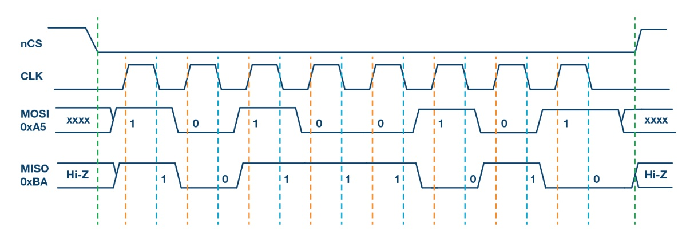
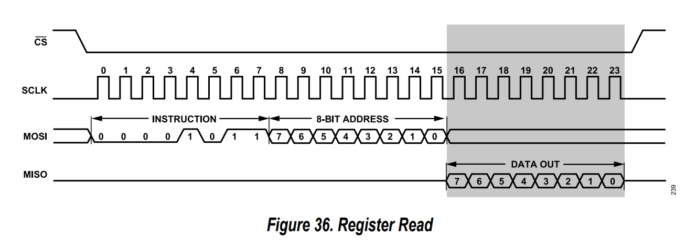

# SPI
 
<!--
-- SPI Controller Part 1 (controller, use model, create testbench, synthesize to find synthesis errors)

- COme up with some "discussion" or exploration exercise as part of the readme.md
- It is hard to follow their testbenches. Need to provide more constraints so that I can follow and see that what was recieved is what was sent
  (prehaps have them provide such a statement in the testbench output)
- Perhaps I provide a detailed module test bench and they create the top-level testbench
  (trade off between learning testenches and testing their circuits properly)
Studnets confused on specification. More detailed steps?
20+ hours!
  - Have them display busy on one of the tri-color LEDs (like uart)
  - Have them describe the state machine encoding from the synthesis report
  - Have them put synchronizers on the reset signal
  * Provide ability to continuously update the registers so you can see it change when tilting the board  
-->
In this assignment, you will create a [SPI](https://en.wikipedia.org/wiki/Serial_Peripheral_Interface) controller for communicating with a SPI device.

The SPI protocol is used extensively in embedded systems as a way to control external devices using a simple serial protocol. 
There are two devices on the Nexys 4 board that use the SPI protocol (each on a different SPI bus): an accelerometer and a QSPI flash memory. 
We will use the controller to communicate with the accelerometer.
The SPI protocol is similar to the UART in that it transfers data serially between two devices. 
The primary difference between SPI and the UART is that SPI includes a clock to synchronize the transfer of data bits and provides simultaneous transmit and receivce.
This allows devices to communicate without agreeing ahead of time on the baud rate.

**Note on Terminology**

Many technical protocols including SPI were originally defined using the terms "master" and "slave" to represent the relationship between different devices in the protocol.
"Master" devices are usually in control of an operation or communication protocol and "slave" devices are designed to respond to the master.
There is a growing effort to replace this master/slave terminology due to its reference to human slavery
(see [here](https://www.allaboutcircuits.com/news/how-master-slave-terminology-reexamined-in-electrical-engineering/),[here](https://www.sparkfun.com/spi_signal_names), and [here](https://en.wikipedia.org/wiki/Master/slave_(technology))).
Several proposed alternatives have been made for these terms in the context of SPI.
For the purposes of this assignment, the term "Main" will be used for the term "Master" and the term "Subnode" will be used for the term "Slave" as described by the [Analog Devices](https://www.analog.com/en/analog-dialogue/articles/introduction-to-spi-interface.html) SPI overview (since we will be talking to an Analog Devices device).
While these terms are not perfect, they retain the "M" letter and the "S" letter from the original terms and thus are consistent with the pin names of the SPI protocol.
Other terminology has been proposed, and it can sometimes be difficult to reconcile the terminology from different devices and data sheets.

## Assignment Instructions

### SPI Controller

The first task for this assignment is to create an SPI controller (or SPI "Main").
The SPI controller is responsible for communicating with SPI "Subnode" sharing the SPI bus.
Review online resources to become intimately familiar with the SPI protocol ([wikipedia](https://en.wikipedia.org/wiki/Serial_Peripheral_Interface),
[Analog Devices](https://www.analog.com/en/analog-dialogue/articles/introduction-to-spi-interface.html), and
[circuit basics](https://www.circuitbasics.com/basics-of-the-spi-communication-protocol/)).
The SPI protocol is a serial protocol that involves the following four signals: a clock (`SCLK`), a chip select (`/CS`), data out or `MOSI` (Main out, subnode in), and data in or `MISO` (Main in, subnode out).
Only one main controller may exist on the SPI bus but multiple sub-nodes may share the bus.
The controller drives the `SCLK`, `/CS`, and `MOSI` signals.
The sub-nodes drive the `MISO` signal.
As a serial protocol, data is shifted one bit per clock cycle.
Unlike the UART, data is being written and read at the same time.
The use of two data signals, `MISO` and `MOSI` allow this full duplex communication to occur.

<!-- SCLK -->
The controller you design will need to generate the `SCLK` signal used by the subunits.
This clock is not continuous as with a conventional clock and will only toggle during a transaction.
When there is no transaction, the signal should be low.
There is a control bit `CPOL` that determines the polarity of the idle `SCLK`.
We will assume `CPOL` = 0 meaning that SCLK is low when no transactions are in process.
The `SCLK` signal will toggle at a much slower rate than our input 100 MHz clock.
For the [accelerometer](https://www.analog.com/media/en/technical-documentation/data-sheets/ADXL362.pdf) we are using, the maximum frequency of the `SCLK` is 10 MHz (the clock low and clock high phases must be 50 ns or longer for a minimum clock period of 100 ns).
Your controller will need to generate the desired `SCLK` frequency based on a parameter, `SPI_CLOCK_HZ`.
Like the UART, you will need to have a state that is multiple clock cycles long for each phase of the `SCLK` signal.
You will determine the number of clock cycles for each phase of `SCLK` by the `SPI_CLOCK_HZ` and `SYS_CLOCK_HZ` module parameters.

Your controller should generate the `/CS`, `SCLK`, and `MOSI` signals as shown in the following SPI transaction diagram:

The reading/writing of a byte will require 17 phases as follows:
  1. `/CS` is driven low and valid data (MSB) is driven by the Main on to `MOSI`
  2. `CLK` is driven high (the subunit will sample `MOSI` on this low to high transition)
  3. `CLK` is driven low (the controller will sample `MISO` on this high to low transition). The controller drives the next bit of data on `MOSI`.
  4. The controller performs steps 2 and 3 for the remaining 7 bits of the byte.
  5. In the final phase, drives `/CS` high to end the transaction. 

When the transaction is over, the controller will have received an 8-bit value that it received from the subunit.
Note that this description assumes the control signal `CPHA` = 0 meaning that data is sampled by the subunit on the rising edge and sampled by the Main controller on the falling edge.

<!--
Two control bits determine the operating mode of the procotol: `CPOL` and `CPHA`.
The `CPOL` determines the polarity of the clock during the IDLE phase and the `CPHA` determines the clock phase for data transfers.
Design your controller to operate with `CPOL` = 0 and 
-->

<!-- back to back transactions -->
Your controller should also support multi-byte transfers by initiating a new transaction immediately after the previous transaction.
An input signal named `hold_cs` will be used to determine whether you should continue the transaction with another byte or end the transaction and return `/CS` to high.
Multi-byte transfers within a single transaction will be required for the accelerometer as shown in the figure below.
In this figure three single byte transfers are performed with `/CS` held low for the entire transaction.

Create a controller with the following top-level ports and parameters:

| Port Name | Direction | Width | Function |
| ---- | ---- | ---- | ----  |
| clk | Input | 1 | Clock |
| rst | Input | 1 | Reset |
| start| Input | 1 | start a transfer |
| data_to_send | Input | 8 | Data to send to subunit |
| hold_cs | Input | 1 | Hold CS signal for multi-byte transfers |
| SPI_MISO | Input | 1 | SPI MISO signal |
| data_received | Output | 8 | Data received on the last transfer |
| busy | Output | 1 | Controller is busy |
| done | Output | 1 | One clock cycle signal indicating that the transfer is done and the received data is valid |
| SPI_SCLK | Output | 1 | SCLK output signal |
| SPI_MOSI | Output | 1 | MOSI output signal |
| SPI_CS | Output | 1 | CS output signal |
| Parameter Name | Default Value | Purpose |
| ---- | ---- | ---- |
| CLK_FREQUENCY | 100_000_000 | Specify the clock frequency of the board |
| SCLK_FREQUENCY  | 500_000 | Specify the frequency of the SCLK |

**Glitches!** (need to latch data going out!)

<!--
**Note:** We have not talked about ASMD diagrams yet so you can ignore the instructions for creating ASMD diagrams.

Begin by creating an ASMD diagram of your SPI controller. 
Carefully review your ASMD diagram to make sure that your FSM and datapath are clearly defined.
You will need to include a copy of your ASMD diagram in your final submission.
Once you are satisfied with your ASMD diagram, create the HDL for your controller.

When designing yoru controller, use the following Verilog 2001/SystemVerilog constructs when you create your controller:
* Use the 'logic' data type
* Use the C-like port specification syntax
* Verilog 2001 parameter declaration and specification
* An enumerated type for your state values  
-->

### SPI Testbench

Once you have created your SPI controller, create a testbench to simulate transactions with your controller.
I have provided a [simulation model](./spi_subunit.sv) for you that simulates a SPI subnode.
Instance your SPI controller and the provided simulation model and connect the two together.
Design your testbench to do the following:
  * Generate a free oscillating clock
  * Provide initial values for the inputs to your receiver
    * First let a few clocks go by (5+) so that it operates with invalid inputs for a few cycles
    * Set all inputs to a default value that does not start the receiver
  * Issue a reset by waiting a few clock cycles, issueing the reset for a few clock cycles, and then deasserting the reset
  * Send at least 10 bytes over SPI as single byte transfers. 
    * Transmit a random 8-bit value for each transaction and print the value you are transmitting
    * Print the value of the data received from the transaction from the subnode
    * Check to make sure the character you sent is the character you received. Print a message that you correctly received the character you sent or print that an error occurred.
  * Send at least 5 transactions that are multi-byte transfers
    * Make sure that the data you send is the data that is received
  * End your simulation with `$stop`

Create a makefile rule named `sim_spi_cntrl` that will run your testbench with the default parameters.

Change the spi_clock rate?

<!--
Use Verilog 2001/SystemVerilog:
* Improved module instantiation with ports
* Use an `interface` in your testbench
* Use a `Queue` in your testbench
* Use at least one of both types of SystemVerilog Assertions
  * Immediate Assertion
  * Concurrent Assertion

-->

### ADXL362 Controller

You will create a module that instances your SPI controller and controls the accelerometer on the Nexys4 board. 
Links to the accelerometer are listed below for your convenience. 

The ADXL362 accelerometer uses a three byte transfer to perform a read or a write to/from its registers (see figures 36 and 37 of the [data sheet](https://www.analog.com/media/en/technical-documentation/data-sheets/ADXL362.pdf)). 
You will need to create a state machine in your top-level design to implement the three byte transfer using the SPI controller (i.e., send one byte, issue hold_ss and issue second byte, and so on for three bytes). 
You will need to support both the write and read register operation as described below:

  * Write register (when left button pressed)
    * Byte 0: write register (0x0a)
    * Byte 1: 8-bit address (taken from the lower 8 switches)
    * Byte 2: Data to write (taken from the upper 8 switches)
  * Read register (when right button pressed)
    * Byte 0: read register (0x0b)
    * Byte 1: 8-bit address (taken from the lower 8 switches)
    * Byte 2: Don't care (capture the byte received on this operation)

The I/O for the top-level design should be designed as follows:
  * The left button (BTNL) should be used to initiate a write to the accelerometer
  * The right button (BTNR) should be used to initiate a read from the accelerometer
  * The lower 8 switches should be used to specify the 8-bit address of the register to read/write
  * The upper 8 switches should be used to specify the 8-bit data used for register writes
  * The 16 LEDs should follow the value of the switches so the user can easily verify that the address/data is properly set.
  * The accelerometer provides two interrupt pins that you do not need to use for this assignment (do not hook up these pins).
  * Instance your seven segment display controller and hook it up so that the last byte received from a register read is displayed on the _lower two digits_ of the seven segment display. The previously received bytes should be shifted up to the other seven segment display so you can still see them (with 8 digits you should be able to display the last four register read values).
  * Highight LED16_B when your SPI controller unit is busy.

Provide the following parameters on your top-level design:

| Parameter Name | Default Value | Purpose |
| ---- | ---- | ---- |
| CLK_FREQUECY | 100_000_000 | Specify the clock frequency of the board |
| SCLK_FRUQENCY  | 500_000 | Specify the frequency of the SCLK |

### SPI Top-Level Testbench

Create a top-level testbench of your top-level design that tests the operation of your top-level AXDL362L controller.
This testbench should be designed as follows:
* Make the top-level testbench parameterizable with for the two top-level parameters.
* Create a free-running clock
* Instance your top-level design
* Instance the [ADXL362 simulation](./adxl362_model.sv) model
  * attach the SPI signals from the top-level design to the SPI signals of the simulation
* Perform the following sequence of events for your testbench:
  * Execute the simulation for a few clock cycles without setting any of the inputs
  * Set default values for the inputs (reset, buttons, and switchces)
  * Wait for a few clock cycle, assert the reset for a few clock cycles, deassert the reset (don't forget that the reset signal for the board is low asserted)
  * Perform the following operations within your testbench by setting the buttons and switches:
    * Read the DEVICEID register (0x0). Should get 0xad
    * Read the PARTID (0x02) to make sure you are getting consistent correct data (0xF2)
    * Read the status register (0x0b): should get 0x40 on power up (0xC0?)
    * Write the value 0x52 to register 0x1F for a soft reset

Make sure your top-level design successfully passes this testbench.
Add a makefile rule named `sim_top` that will perform this simulation from the command line.

### Implementation and Download

At this point you are ready to implement your design, generate a bitfile and download your design to your board.
Create a new makefile rule named `gen_bit` that will generate a bitfile named `spi_adx362l.bit` for your top-level design with the default top-level parameters.

Run your design through the implementation tools and make sure there are *no warnings*. 
You may need to [adjust the message severity level](../resources/vivado_command_line.md#adjusting-message-severity-levels) fo rsome messages.

Once you have created your design and downloaded it to the board, you can make sure it works by trying the following:

  * Read the DEVICEID register (0x0). Should get 0xad
  * Read the PARTID (0x02) to make sure you are getting consistent correct data (0xF2)
  * Read the status register (0x0b): should get 0x40 on power up (0xC0?)
  * Write the value 0x52 to register 0x1F for a soft reset
  * Write the value 0x00 to register 0x1F to clear the soft reset
  * Write the value 0x02 to register 0x2D to set "enable measure command"
  * Read the status register (0x0b): should get 0x41 now (you won't get any readings until the status is set to 0x41)
  * Write the value 0x14 to register 0x2C to set the Filter Control Register control register (50Hz)
  * Read the various accelerometer values to see changes in the acceleration (You can rotate the board around different axis to see changes in the readings)
    * Register 0x08 for XDATA
    * Register 0x09 for YDATA
    * Register 0x0A for ZDATA
                                      
Resources:
  * [Nexys DDR user guide](https://digilent.com/reference/_media/reference/programmable-logic/nexys-4-ddr/nexys4ddr_rm.pdf)
  * [ADXL362 Product Page](https://www.analog.com/en/products/adxl362.html)
  * [ADXL362 Data Sheet](https://www.analog.com/media/en/technical-documentation/data-sheets/ADXL362.pdf)

## Submission and Grading

1. Prepare your repository
    * `sim_spi_cntrl`
    * `synth_spi_cntrl`

  * Make sure all of the _essential_ files needed to complete your project are committed into your repository
  * Make sure you have a  `.gitignore` file for your assignment directory and that all intermediate files are ignored.
  * Make sure you have a `makefile` with all the necessary make rules
    * `sim_spi_cntrl`: performs command line simulation of the spi controller
    * `sim_top`: performs command line simulation of the top SPI testbench
    * `gen_bit`: Generates a bitstream for your top-level SPI design
2. Commit and tag your repository
  * Make sure all of your files are committed and properly tagged (using the proper tag)
3. Create your assignment [Readme.md](../resources/assignment_mechanics.md#assignment-submission) file
  * Create the template file based on the instructions linked above
  * Add the following items for the assignment-specific section of the readme:
    1. **Resoures**: Provide a summary of the number of resources your design uses (see the output from the utilization report). Specifically, indicate the number of `Slice LUTs`, `Slice Registers`, and `Bonded IOB` resources your design uses.
    2. **Warnings**: You should not have _any_ warnings in your project as described in the assignment instructions above. Make sure you don't have any warnings and state this in your readme.
    3. **Timing**: Determine the "Worst Negative Slack" (or WNS). This is found in the timing report and indicates how much timing you slack you have with the current clocking.

